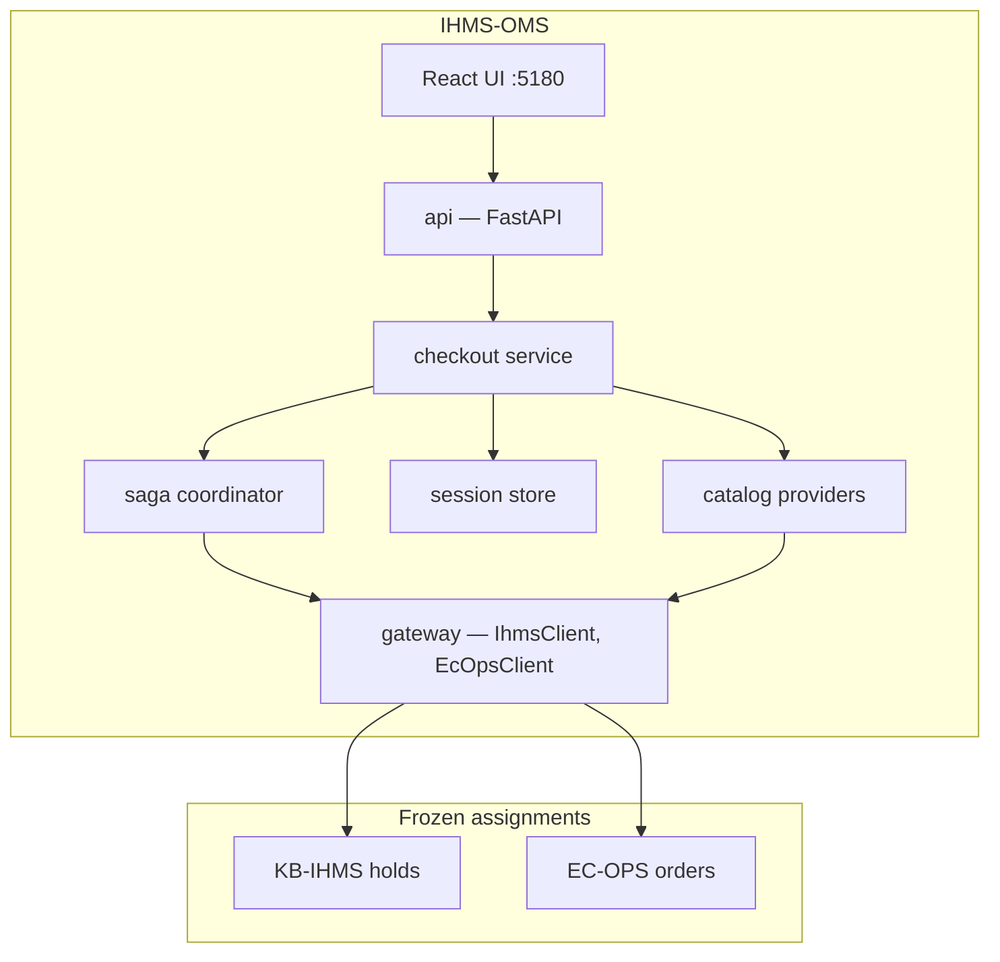

# Architecture

## Overview

IHMS-OMS is the checkout orchestrator between a React shop UI and two frozen upstream services (KB-IHMS, EC-OPS).



**Entry point for all docs:** [index.md](index.md)

---

## Module layout

```
src/
  api/           # Routers, middleware (observability IDs), error mapping
  checkout/      # CheckoutService — workflow entry
  catalog/       # JsonCatalog, IhmsLiveCatalog, inventory enrichment
  gateway/       # ONLY upstream httpx calls
  session/       # CheckoutSession model + in-memory store
  saga/          # Coordinator, idempotency, compensate, reconcile, finalize
  observability/ # JSON logs, Prometheus metrics
frontend/        # React shop — orchestrator API only
catalog/         # products.json, ecops-mapping.json, ihms-products.json
docker/          # Dockerfile, mock upstreams, Prometheus
scripts/         # verify.sh, stack scripts (bash + PowerShell)
```

### Dependency rules (ADR-007)

1. `api` imports `checkout` only — not `gateway` directly.
2. `checkout` orchestrates `saga`, `session`, `catalog`.
3. `saga` and `catalog` call `gateway` for upstream I/O.
4. `frontend/` calls orchestrator REST only.

---

## Checkout entry points

| API route | CheckoutService / Saga | Use case |
|-----------|------------------------|----------|
| `POST /sessions/checkout` | `place_order` (new session) | One-click UI |
| `POST /sessions/{id}/place-order` | `place_order` | API clients |
| `POST /sessions/{id}/hold` + `/confirm` | `place_hold` + `confirm` | Step-by-step / E2E |

All order paths require `Idempotency-Key` and propagate `correlation_id` to EC-OPS as `client_reference`.

---

## Session state machine

| State | Meaning |
|-------|---------|
| `CREATED` | Session open, no hold |
| `HELD` | IHMS hold active |
| `CONFIRMED` | EC-OPS order placed, checkout complete |
| `FULFILL_PENDING` | Order OK; IHMS fulfill retrying |
| `ABANDONED` | User cancelled; hold released |
| `COMPENSATED` | Order failed; hold released |
| `RECONCILED` | Timeout resolved via EC-OPS lookup |

Diagram: [WORKFLOWS.md](WORKFLOWS.md)

---

## Catalog anti-corruption (ADR-002)

| File | Purpose |
|------|---------|
| `catalog/products.json` | Mock / fallback SKUs |
| `catalog/ihms-products.json` | Prices/SKUs for real IHMS `productId`s |
| `catalog/ecops-mapping.json` | SKU → EC-OPS line `product_name` |

`IhmsLiveCatalog` tries `GET /api/products` then `GET /api/inventory` (`ihms_catalog_mode=auto`).

---

## Gateway boundary

| Client | Upstream endpoints |
|--------|-------------------|
| `IhmsClient` | `/api/holds`, `/api/inventory`, `/api/products`, fulfill |
| `EcOpsClient` | `/orders`, auth bearer on all calls |

Trace headers logged via `gateway/observability.py`; EC-OPS echoes IDs.

---

## Observability

| Concern | Implementation |
|---------|----------------|
| HTTP IDs | Middleware → `X-Request-ID`, `X-Correlation-ID`, `X-Trace-ID` |
| Saga steps | Structured JSON logs (`checkout.saga`) |
| Metrics | `/metrics` — Prometheus counters |
| Upstream debug | `/health/upstreams` — IHMS catalog probe + EC-OPS auth |

Details: [OBSERVABILITY.md](OBSERVABILITY.md)

---

## Deployment topology

Single `docker-compose.yml`:

| Service | Port | Role |
|---------|------|------|
| orchestrator | 8000 | FastAPI |
| ui | 5180 | nginx + React |
| ihms (mock) | 8080 | Wire-compatible IHMS |
| ecops (mock) | 8012 | Wire-compatible EC-OPS |
| prometheus (profile obs) | 9090 | Metrics scrape |

Real upstream mode: orchestrator + UI only; KB-IHMS :5000, EC-OPS :8002 on host.

Details: [DOCKER.md](DOCKER.md)

---

## Sequence diagrams

- [sequences/checkout.md](sequences/checkout.md)
- [sequences/compensation.md](sequences/compensation.md)
- [sequences/reconciliation.md](sequences/reconciliation.md)
- [sequences/cancel.md](sequences/cancel.md)
- [sequences/expiry.md](sequences/expiry.md)

---

## Design records

- [DESIGN-DECISIONS.md](DESIGN-DECISIONS.md) — ADR index
- [DECISION-MATRIX.md](DECISION-MATRIX.md) — 60-second reference
