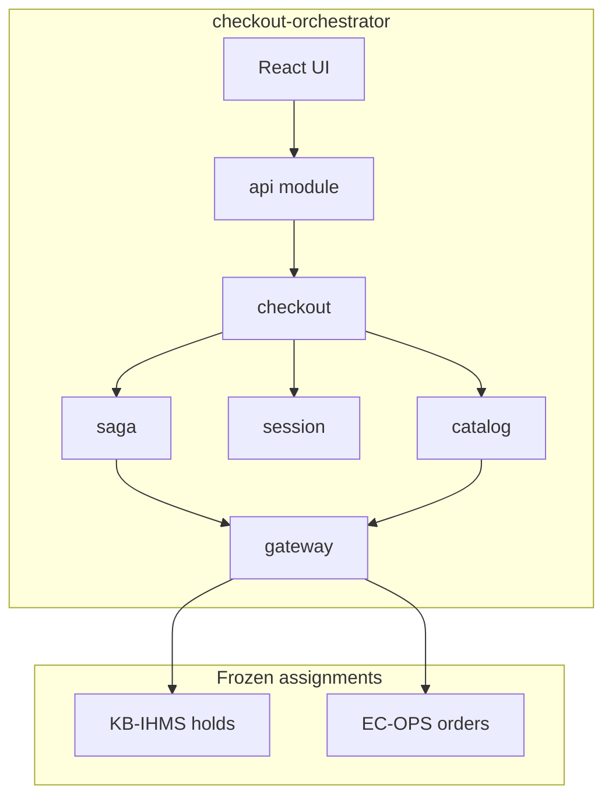

# Architecture

## Overview

The checkout orchestrator sits between a React UI and two frozen upstream services:



## Module layout

```
src/
  api/           # FastAPI routers, middleware (request/correlation/trace IDs)
  checkout/      # Confirm, abandon workflow entry points
  catalog/       # CatalogProvider protocol + JsonCatalogProvider
  gateway/       # IhmsClient, EcOpsClient — ONLY upstream HTTP calls
  session/       # CheckoutSession persistence
  saga/          # Coordinator, compensation, idempotency, reconciliation
```

### Dependency rules

1. `api` may import `checkout` only (not `gateway` directly).
2. `checkout` orchestrates `saga`, `session`, and `catalog`.
3. `saga` and `catalog` call `gateway` for upstream I/O.
4. No module outside `gateway/` may use httpx against IHMS or EC-OPS URLs.
5. `frontend/` calls orchestrator REST API only.

## Checkout session lifecycle (Phase 3)

| State | Description |
|-------|-------------|
| `CREATED` | Session opened; no hold yet |
| `HELD` | IHMS hold placed; countdown active |
| `CONFIRMED` | EC-OPS order created; hold consumed |
| `ABANDONED` | User cancelled; hold released |
| `COMPENSATED` | Order failed after hold; hold released |
| `RECONCILED` | Ambiguous timeout resolved via EC-OPS query |

## Catalog anti-corruption

`catalog/products.json` maps orchestrator SKUs to:

- `ihms_product_id` — KB-IHMS product reference
- `ecops_item_code` — EC-OPS order line item code

See [ADR-002](adr/ADR-002-catalog-provider.md).

## Sequence diagrams

Flow details live in dedicated files — not embedded here:

- [sequences/checkout.md](sequences/checkout.md)
- [sequences/cancel.md](sequences/cancel.md)
- [sequences/expiry.md](sequences/expiry.md)
- [sequences/compensation.md](sequences/compensation.md)
- [sequences/reconciliation.md](sequences/reconciliation.md)

## Phase 1 status

Gateway clients, saga flows, and UI: saga implemented in Phase 3; React UI Phase 4.
