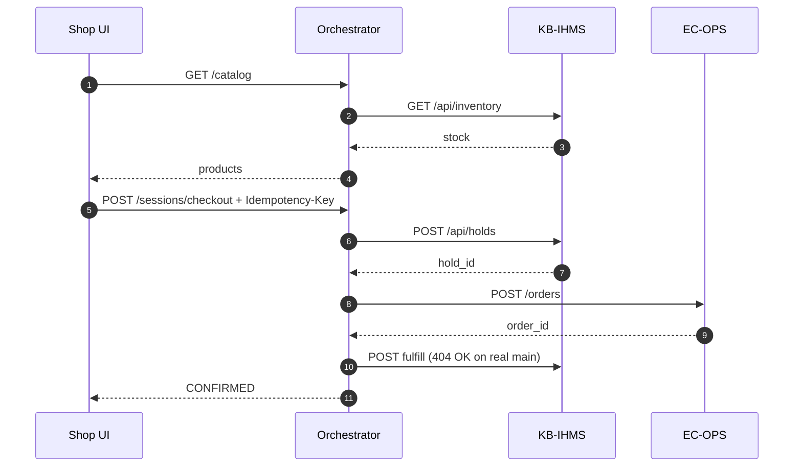
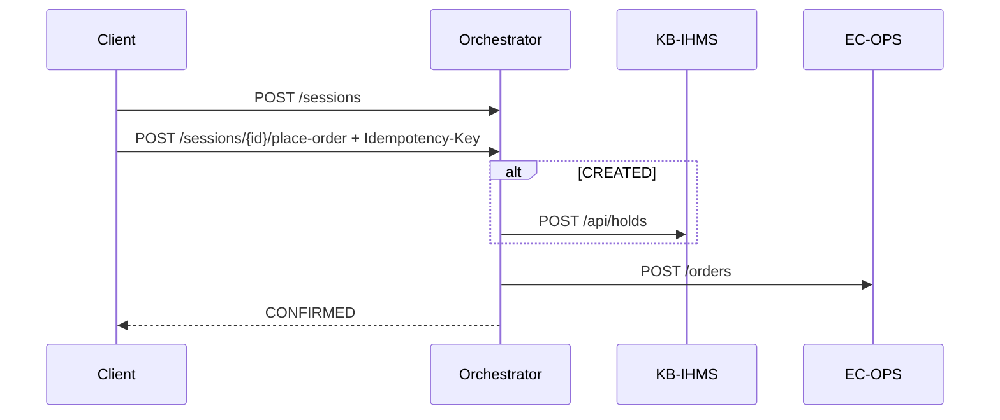
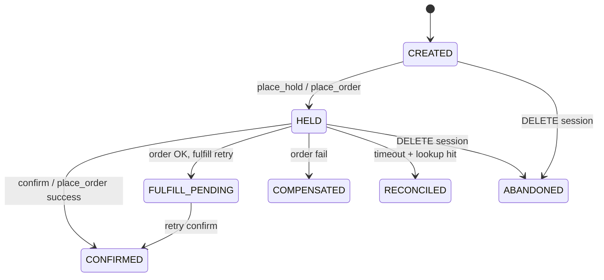

# Checkout Workflows

End-to-end flows for IHMS-OMS v0.11. For failure branches see [FAILURE-SCENARIOS.md](FAILURE-SCENARIOS.md).

---

## One-click checkout (production UI)

---

## Place order on existing session

---

## Saga state machine

---

## Stack modes

| Mode | Script / task | Upstreams |
|------|---------------|-----------|
| Mock | `dev-up.ps1`, **Cursor: Quick start mock** | Containers in compose |
| Real | `real-upstream.ps1`, **Cursor: Real dev environment** | KB-IHMS + EC-OPS on host |

---

## Test coverage

| Workflow | Integration | E2E |
|----------|-------------|-----|
| One-click | `test_one_click_checkout` | `test_one_click_checkout` |
| Place order | `test_place_order_on_existing_session` | `test_place_order_on_existing_session` |
| Idempotency | `test_place_order_idempotency_replay` | `test_place_order_idempotency_replay` |
| Hold → confirm | `test_happy_path_hold_and_confirm` | `test_happy_path_hold_and_confirm` |
| Compensation | `test_one_click_checkout_compensates_*` | `test_confirm_compensates_*` |
| Upstream health | `test_health_upstreams_*` | `test_health_upstreams` |
