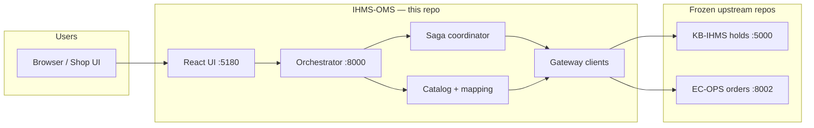

# IHMS-OMS Documentation Index

Central map for the checkout orchestrator (**IHMS-OMS**). Start here, then drill into topic docs.

**Version:** 0.11.0 · **Stack:** Docker Compose · **UI:** http://localhost:5180

---

## Quick links

| I want to… | Go to |
|------------|--------|
| Run the stack (Windows/Cursor) | [DOCKER.md](DOCKER.md) · task **Cursor: Quick start mock + open UI** |
| Run against real KB-IHMS + EC-OPS | [DOCKER.md](DOCKER.md#real-kb-ihms--ec-ops-demo--interview) · [IHMS-UPSTREAM.md](IHMS-UPSTREAM.md) · [EC-OPS-UPSTREAM.md](EC-OPS-UPSTREAM.md) |
| Understand architecture in 60s | [DECISION-MATRIX.md](DECISION-MATRIX.md) |
| See module boundaries | [ARCHITECTURE.md](ARCHITECTURE.md) |
| Trace checkout flows | [WORKFLOWS.md](WORKFLOWS.md) · [sequences/](sequences/) |
| Debug failures | [FAILURE-SCENARIOS.md](FAILURE-SCENARIOS.md) |
| Why we built it this way | [DESIGN-DECISIONS.md](DESIGN-DECISIONS.md) · [adr/](adr/) |
| Run tests | [Testing](#testing) below · `bash scripts/verify.sh` |
| Contribute / agents | [../AGENTS.md](../AGENTS.md) · [../ROADMAP.md](../ROADMAP.md) |

---

## System context



| Repo | Role | Agent may edit code? |
|------|------|----------------------|
| **IHMS-OMS** (here) | BFF, saga, catalog mapping, UI | Yes |
| [KB-IHMS](https://github.com/iamkaranvalecha/KB-IHMS) | Inventory holds | No — adapt at gateway |
| [EC-OPS](https://github.com/iamkaranvalecha/EC-OPS) | Order lifecycle | No — adapt at gateway |

---

## Checkout workflows (v0.11)

Two user-facing paths; both use the same saga (`place_order` → hold → EC-OPS order → finalize).

| Path | API | UI |
|------|-----|-----|
| **One-click** | `POST /sessions/checkout` | Default **Place order** button |
| **Step-by-step** | `/sessions` → `/hold` → `/confirm` | Debug / E2E |
| **Place on session** | `POST /sessions/{id}/place-order` | When session already exists |

See [WORKFLOWS.md](WORKFLOWS.md) for diagrams.

---

## API surface

| Method | Path | Purpose |
|--------|------|---------|
| GET | `/catalog` | Products + live IHMS stock |
| GET | `/health/upstreams` | Connectivity + EC-OPS auth probe |
| POST | `/sessions/checkout` | One-click checkout |
| POST | `/sessions/{id}/place-order` | Hold + order on existing session |
| POST | `/sessions/{id}/hold` | Hold only |
| POST | `/sessions/{id}/confirm` | Order + finalize |
| DELETE | `/sessions/{id}` | Abandon |

Swagger: http://localhost:8000/docs

---

## Testing

```bash
bash scripts/verify.sh              # unit + contract + component + integration
STACK=1 bash scripts/verify.sh      # + e2e (Docker)
cd frontend && npm test             # UI unit tests
```

| Tier | Path | Focus |
|------|------|-------|
| Full workflow | `tests/integration/test_full_workflow.py` | One-click, place-order, idempotency, upstream health |
| E2E | `tests/e2e/test_full_stack.py` | Docker network, mock upstreams |

---

## Document map

| Category | Documents |
|----------|-----------|
| Architecture | [ARCHITECTURE.md](ARCHITECTURE.md), [DECISION-MATRIX.md](DECISION-MATRIX.md), [DESIGN-DECISIONS.md](DESIGN-DECISIONS.md), [adr/](adr/) |
| Flows | [WORKFLOWS.md](WORKFLOWS.md), [sequences/](sequences/) |
| Operations | [DOCKER.md](DOCKER.md), [OBSERVABILITY.md](OBSERVABILITY.md), [PERFORMANCE.md](PERFORMANCE.md) |
| Upstreams | [IHMS-UPSTREAM.md](IHMS-UPSTREAM.md), [EC-OPS-UPSTREAM.md](EC-OPS-UPSTREAM.md) |
| Quality | [FAILURE-SCENARIOS.md](FAILURE-SCENARIOS.md) |
| Process | [PROJECT-WORKFLOW.md](PROJECT-WORKFLOW.md), [../AGENTS.md](../AGENTS.md), [../ROADMAP.md](../ROADMAP.md) |
