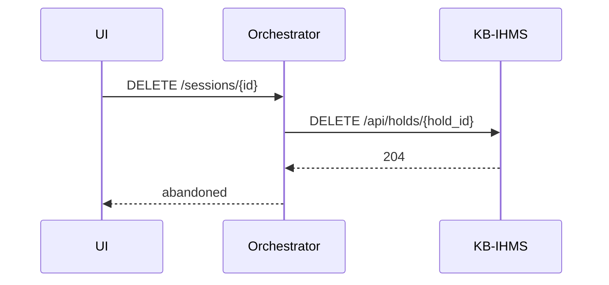

# Sequence: Cancel / Abandon

**Use case:** UC-6 (abandon checkout)

**Status:** Stub — finalize in Phase 3

## Flow

## Notes

- Only applicable when session is in `HELD` state.
- If no hold was placed, transition directly to `ABANDONED`.
