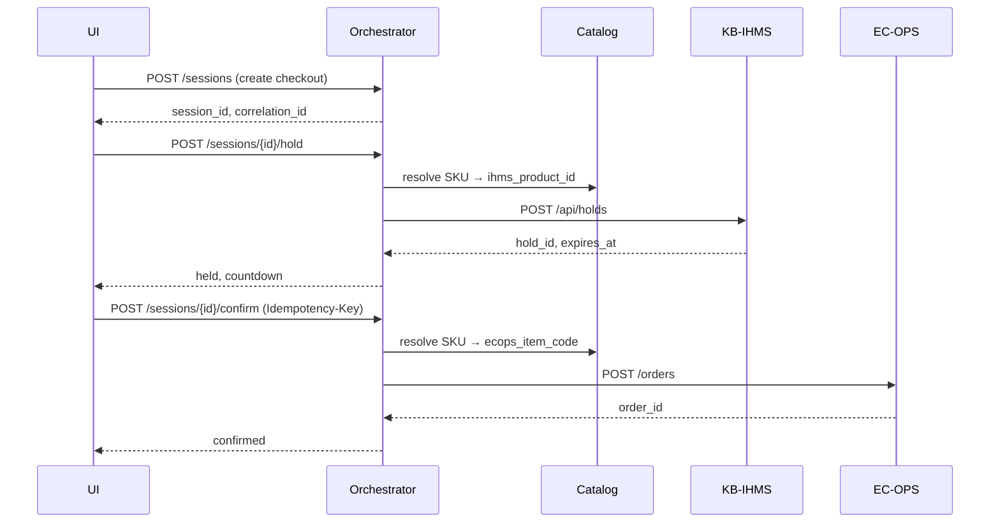

# Sequence: Checkout (Happy Path)

**Use cases:** UC-3 (browse/add), UC-5 (confirm order)

**Status:** Implemented (Phase 3)

## Actors

- User / UI
- Orchestrator API
- CatalogProvider
- KB-IHMS
- EC-OPS

## Flow

## Failure branches

See [FAILURE-SCENARIOS.md](../FAILURE-SCENARIOS.md) — hold fail, duplicate confirm.

## Phase gate

- [ ] Integration test covers happy path
- [ ] Idempotency key cached on duplicate confirm
