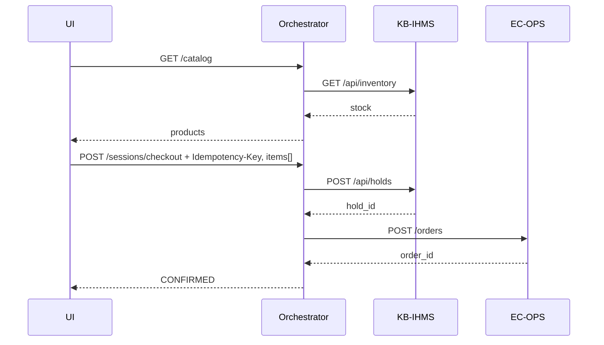
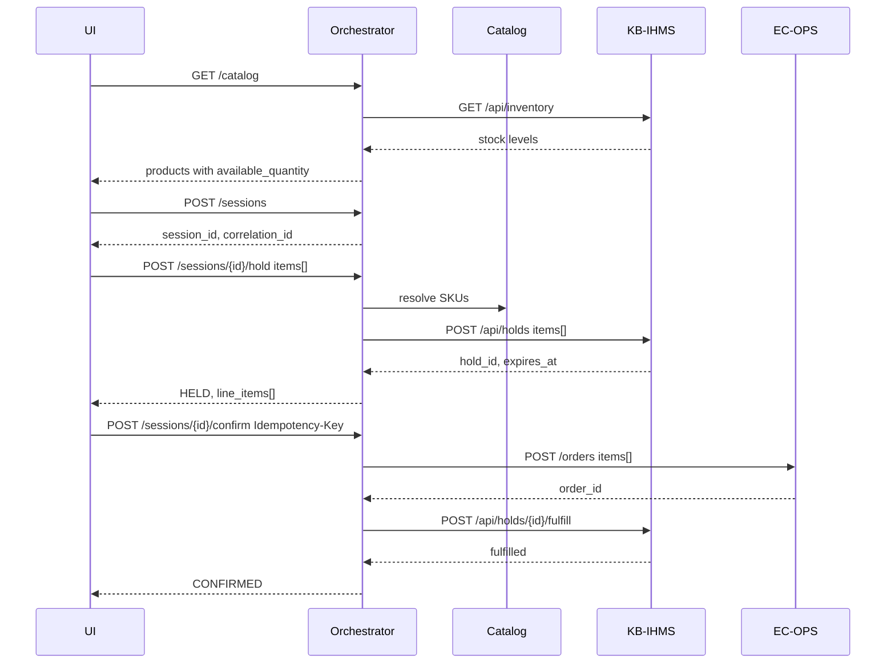

# Sequence: Checkout (Happy Path)

**Use cases:** UC-3 (browse/add), UC-5 (confirm order)

**Status:** Implemented (Phase 3+)

## Actors

- User / UI
- Orchestrator API
- CatalogProvider
- KB-IHMS
- EC-OPS

## One-click flow (v0.11 UI default)

The shop UI calls a single endpoint instead of session → hold → confirm:

API: `POST /sessions/{id}/place-order` — same saga when a session already exists.

See [WORKFLOWS.md](../WORKFLOWS.md) for full diagrams.

## Fulfill pending branch

When EC-OPS creates the order but IHMS fulfill fails after retries:

1. Session moves to `FULFILL_PENDING` with `order_id` set.
2. API returns 200; UI shows retry finalize.
3. Retry confirm with the **same** `Idempotency-Key` — no duplicate EC-OPS order.
4. Abandon is blocked until fulfill completes or ops intervenes.

## Failure branches

See [FAILURE-SCENARIOS.md](../FAILURE-SCENARIOS.md) — hold fail, duplicate confirm, fulfill pending, reconciliation.

## Phase gate

- [x] Integration test covers happy path
- [x] Idempotency key cached on duplicate confirm
- [x] Multi-item hold + confirm integration test
- [x] Fulfill pending retry integration test
- [x] One-click checkout (`POST /sessions/checkout`) integration + e2e
- [x] Place order on session (`POST /sessions/{id}/place-order`) integration + e2e
