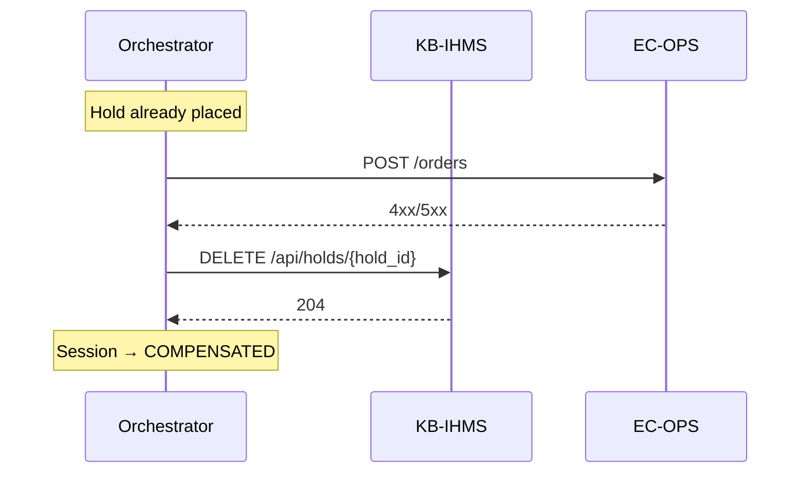

# Sequence: Compensation

**Use case:** UC-6 variant — order fails after successful hold

**Status:** Implemented (Phase 3)

## Flow

## Saga rule

Compensation is mandatory. Never leave an orphaned hold after order failure.

See [ADR-004](../adr/ADR-004-saga-compensation.md).
