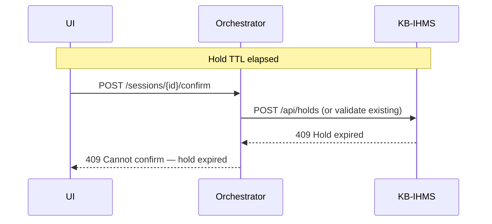

# Sequence: Hold Expiry

**Use case:** UC-7 (hold expires before confirm)

**Status:** Stub — finalize in Phase 3

## Flow

## UI behaviour

- Countdown timer from `expires_at` returned at hold time.
- Disable confirm button when expired; offer restart checkout.
