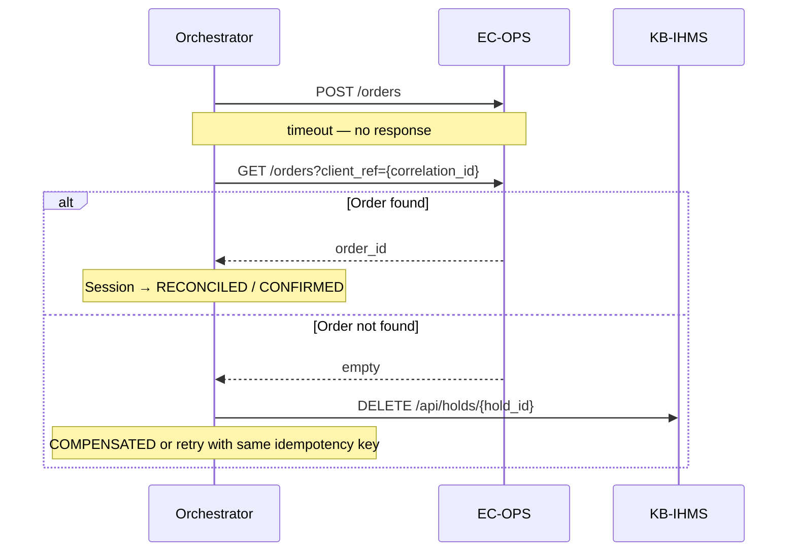

# Sequence: Reconciliation After Timeout

**Scenario:** `POST /orders` times out — order may or may not exist

**Status:** Stub — implement in Phase 3

## Problem

```text
POST /orders → timeout → order created? UNKNOWN
```

This is the classic ambiguous outcome in distributed systems.

## Reconciliation flow



## Decision rules

1. **Found** → attach `order_id`, complete session; do not release hold if order references hold.
2. **Not found** → safe to compensate OR retry `POST /orders` with same idempotency key.
3. Log `step: reconcile` with all IDs for audit.

See [ADR-008](../adr/ADR-008-reconciliation-timeout.md).
